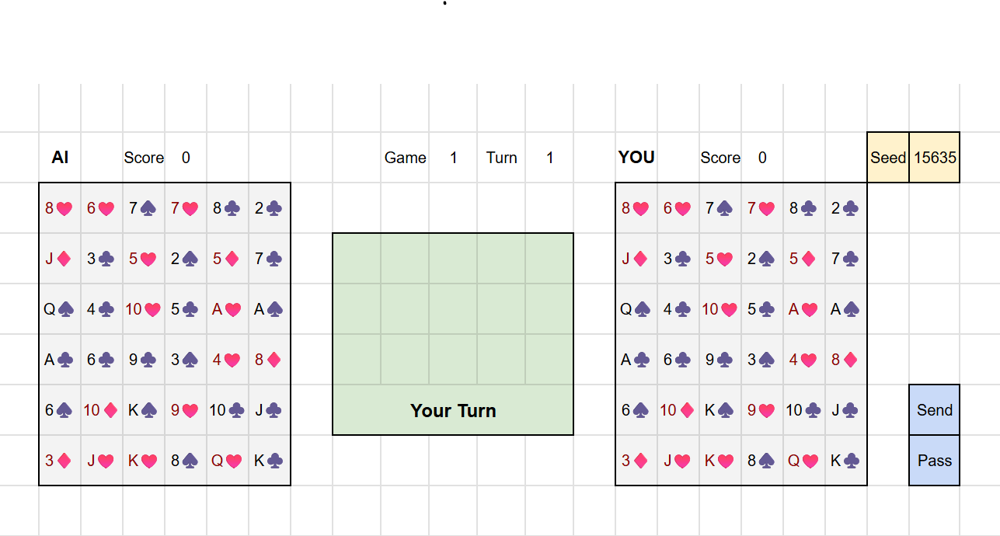
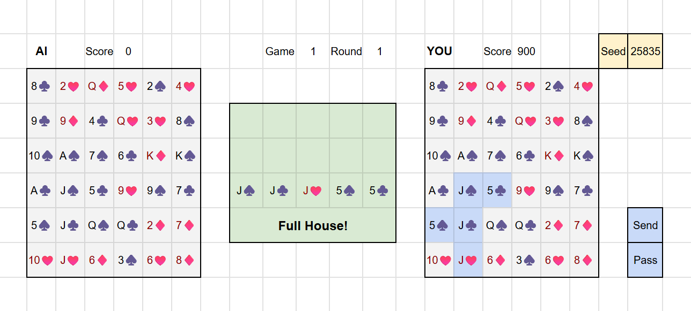
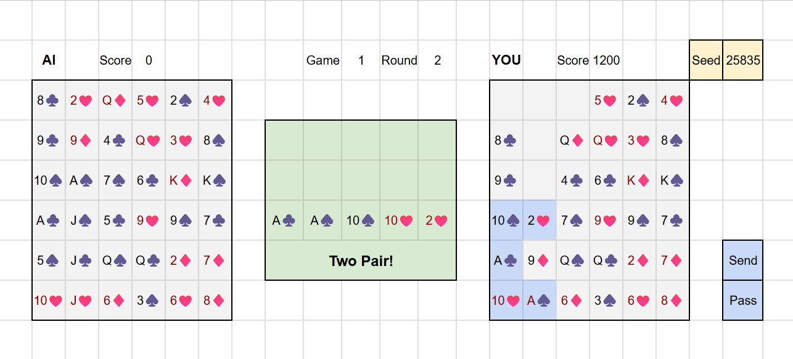

### Moltivation

I plan to create a prototype for my own video game, a puzzle game using standard playing cards. A video game is a complex software project that I believe will teach me many essential skills in computer science and software engineering, including but not limited to data structures and algorithms, design patterns, product design, project management, testing, and deployment. I will use Unity and C# to implement this game, and thus this project will also teach me a widely used game engine and a popular programming language.

### Goal

Even though this game does not rely on fancy graphics, it still requires an immense endeavor as a mid-sized project. Due to time constraints, I will solely focus on CS-related aspects of this game, using simple ready-made art assets. By the end of this summer, I will deliver a playable build, which will be a simple prototype that contains the base game with essential mechanics and with an active enemy AI. This prototype will not include any art or music or characters or narrative elements.

### Game Design

This game is a card puzzle with numerous strategic variation and technical details. Here is a summary of the core game loop and mechanics, illustrated by a wireframe that I created with Google Sheets.

The game contains two boards, each of which is a 6 x 6 grid. Each player receives identical 36 cards randomly drawn from the deck. Unlike most card games, each player in this game has perfect information about each other's board.

Players can select one to five cards. If we select more than one card, selected cards must be orthogonally connected. These cards must form a valid poker hand, including:
•	One card: Single
•	Two cards: Pair
•	Three cards: Three of a kind (without two kicker cards)
•	Four cards: Invalid
•	Five cards: Two pair, flush, straight, full house, straight flush, four of a kind (with a kicker card)
Here we see five cards forming a valid full house (highlighted in blue), which are orthogonally connected. These five cards are sent to the table. 

Once we have sent cards to the table, these cards are removed from our board. The game applies gravity to the board. The cards above the empty cells fall until they reach the ground or other cards, thus changing the board state. 

Now the opponent needs to answer with a stronger full house. Players are required to follow the current hand type on the table. If players cannot respond or do not want to respond, they can choose to pass this turn. This gives the other player an initiative for the next turn, which enables this player to send any valid hand type to the table and define the next hand type to follow. For example, after our full house, we can send a two pair to the table.

Every time we send a hand to the table, we gain points, which are calculated by card ranks and hand rarity. Each player increases their own raw score as the game progresses and as cards get removed from their own boards.

A game ends when one of player clears the entire board before the other does. The winner of the game can redeem 100% of raw score acquired in this game. The loser only redeems 50% of raw score. It is thus important to both win a game and to send valuable hands. The winner also receives a bonus based on how many cards the loser still holds when a game ends. The bonus will be substantial for a landslide victory. A duel can consist of multiple games. The player who has the higher cumulative score wins the duel.

### Math & AI

Mathematically, we can have P(52, 36) = 52!/16! permutations or board layouts for this game. This is an astronomical number. In practice, I will just use a seeding system to deterministically shuffle the deck so that the game can predicably create a specific board, which will be useful for level design. A seed is a large integer that goes through a chain of arithmetic operations to produce deterministic position indices for shuffling. My seed ID will use 6 characters in a base-32 system. This allows me to support up to 32^6 seeds (approximately 1 billion). I believe this should be more than sufficient for an indie game.

I plan to display the seed ID of a board on the user interface and provide a copy button. I will add a feature that enables players to enter a seed to generate a specific board so that they can replay a board that they find interesting or challenging.

Due to the mathematical complexity of this game, it requires a competent enemy AI to choose good moves. For this prototype, I will first focus on creating an AI that can correctly follow the rules of the game so that players can complete a game without glitches. Then I will use minimax and heuristic decision-making to add some reasoning ability to the AI. The skill level of the AI will depend on how much time I have for AI studies this summer.

### Checklist

Here is a check list of goals that I plan to complete:

- Learn Unity 2D and C# (just enough to make this game)
- Learn design patterns for video games
- Complete the specification for the base game
- Design core data structures and algorithms 
- Implement the essential game mechanics
- Implement a simple yet functional user interface
- Implement an active enemy AI (possibly implemented with minimax and heuristic-based decision making)
- Deliver a playable build in the format of WebGL, possibly hosted on Itch.io with restricted visibility
