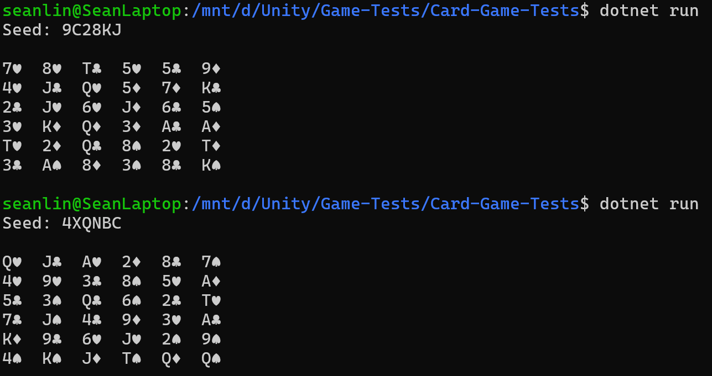

### What I did last week:

I haven't made a lot of progress in terms of game design. But I've been working on important infrastructure for the game.

I have written pure C# scripts (i.e. those that do not need Unity to run) for some core game logic. Since the Unity editor is quite heavy and resource demanding, I'm currently using .NET to run my C# code as a console app in Linux terminal. This is very lightweight and much easier to test and debug.

So far, I can randomly generate a seed ID, use this seed ID to shuffle a card deck, populate the board with the shuffled deck, and then print the board data and show the seed ID. In the following screenshot, you can see that each board has a corresponding seed ID.

I also designed a grid structure and coordinate system following the conventions of computer graphics. This will be very important for my next step, which is to verify card connectivity. It will also be used by the input system and by my AI to explore potential legal hands on a board.

Since my art skills are lacking, I asked ChatGPT to generate a cheat sheet based on my design. I need to be extra careful about card positions, indices, and coordinates in this game. The cheat sheet has been very helpful.

### What I am doing:

I'm working on more pure C# scripts for core game logic, including card selection, connectivity checking, hand type evaluator, hand strength evaluator, hand score evaluator, gravity, board manager, etc. I will also test these pure # scripts in Linux terminal using .NET without running Unity.

If time permits, I will work on more game logic. For example, I need to design a turn system to manage the workflow. I will also design a central table that defines the current hand type and decides whether the selected cards are allowed to send to the table.

Later, I will also need to create unit tests to make sure my game logic is solid, especially for hand type evaluators. I don't think I will touch any art assets until mid July. We only will see a bland console in the next few weeks.

The workload is heavier than I had expected, but I really enjoy building the game.

